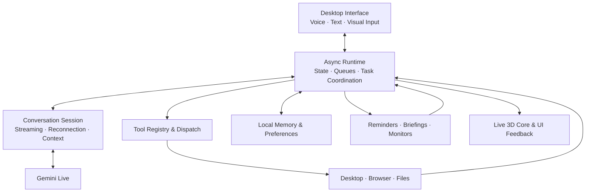

# Jarvis multimodal project

### Multimodal Desktop Assistant · Event-Driven Runtime · Tool Orchestration

**JARVIS connects conversational AI with practical desktop workflows through a responsive interface, modular automation tools, and persistent user context.**

The application coordinates voice streaming, visual input, browser interaction, local actions, and a speech-reactive 3D core. Gemini Live provides conversational inference; the surrounding application manages audio, session lifecycle, execution, state, persistence, and presentation.

## Preview

  
  

## Core Capabilities

| Area | Capabilities |
| --- | --- |
| **Conversational interaction** | Streaming voice conversations, typed commands, configurable voices, microphone controls, optional local wake-word detection, and push to talk. |
| **Visual and document assistance** | Screen and camera analysis, file attachments, document summarization, and contextual explanations. |
| **Desktop automation** | Application launch, foreground-window control, clipboard reading and clearing, screenshots, and supported Windows settings. |
| **Browser workflows** | Navigation and interaction through the existing Chrome window, preserving the user's active browser profile. |
| **Personal context** | Locally stored preferences and facts, searchable memory, reminders, startup briefings, and sourced India news. |
| **Extensibility and remote input** | Dynamically discovered tools, configurable Python plugins, and an optional paired phone dashboard for text, audio, and file transfer. |

### Gmail & Email Assistance

JARVIS opens Gmail through the user's existing signed-in Chrome profile. Its language, screen-analysis, and browser-control tools support composing email content, preparing drafts and replies, and summarizing visible or explicitly supplied messages. User-requested send actions use the browser interface; completion must be verified in Gmail.

These workflows use the Gmail API for email access and actions, with access depending on the configured credentials and active account permissions.

## System Architecture

The application is organized around a desktop interaction layer, an asynchronous runtime, and modular execution services.

### Runtime Engineering

- **Concurrency and responsiveness:** Qt runs the interface on the main thread; a background asyncio runtime coordinates microphone capture, inbound responses, playback, and background services. Audio queues separate these stages, and blocking tool handlers run in executor threads.
- **Session lifecycle:** reconnect handling, API-provided session resumption, and sliding-window context compression support longer conversations. Voice and audio-device changes are applied through controlled reconnection.
- **Tool contracts:** action and plugin loaders validate declarations, expose argument schemas, reject naming conflicts, and return handler results or errors to the conversation. Supported scheduling metadata controls delivery behavior.
- **Context management:** compact memory is incorporated into the session prompt; additional facts can be retrieved through local search. Preferences and session summaries persist independently of the window.
- **Interaction controls:** microphone gating, echo handling, manual interruption, confirmation for selected actions, and undo for registered changes coordinate user input with execution.
- **Rendering integration:** a local browser worker renders procedural Three.js geometry. A frame bridge presents the live animation in Qt, while assistant state and audio energy drive motion, glow, and speech feedback.

## My Contributions

My work on this build focused on integration, interaction design, and desktop workflow reliability:

- **Redesigned the interface** around a centered golden core, with one control to reveal the workspace panels and file attachments integrated into message input.
- **Integrated and tuned the supplied 3D renderer**, including independently moving particle rings, restrained thinking animation, speech reactivity, and startup/layout fixes.
- **Refined desktop workflows**, including clipboard handling, existing-Chrome behavior, screenshot storage, foreground-window checks, and Windows settings access.
- **Improved configuration and maintainability** through private environment-based API-key loading, credential migration, module reorganization, and clearer feature documentation.

## Technology Stack

**Application:** Python · asyncio · PyQt6  
**AI & Audio:** Google Gen AI SDK · Gemini Live · sounddevice · NumPy  
**Visualization & Automation:** Three.js · Playwright · PyAutoGUI · Windows integration helpers  
**Remote Dashboard & Persistence:** FastAPI · Uvicorn · Local JSON storage

## Project Scope

This public showcase presents the interface, capabilities, and engineering approach through screenshots and demonstrations. The complete application source is maintained separately. Individual workflows depend on available tools, platform permissions, network connectivity, and active application sessions.

The build extends an existing assistant foundation and supplied visualization assets. Reused components remain subject to their applicable attribution and license requirements.
